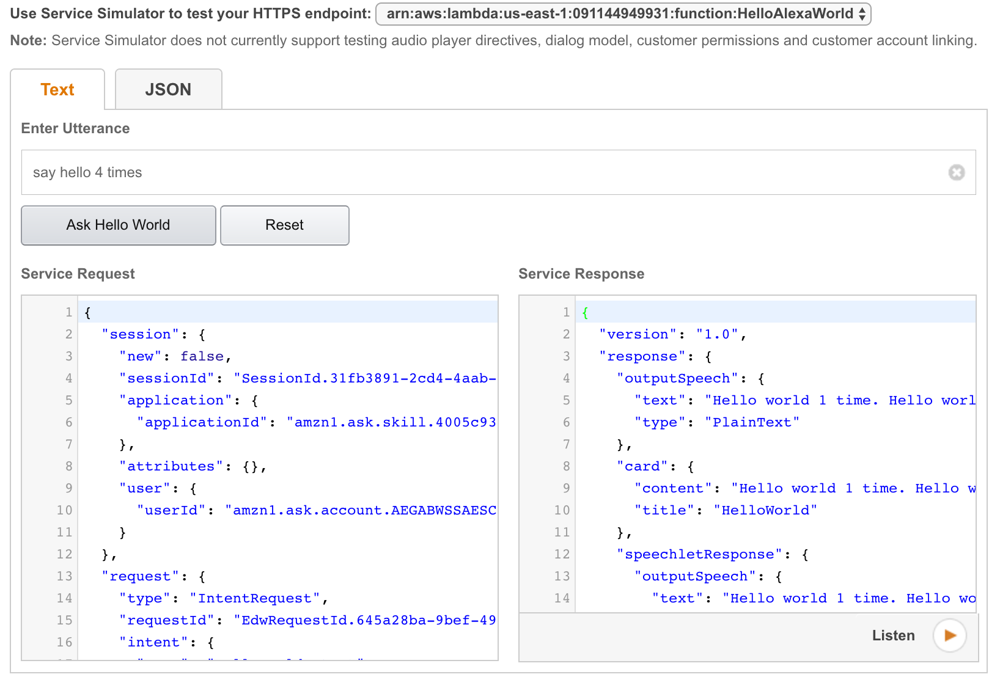

= Hello World using an Alexa Skill and Java

== Pre-setup Alexa Skill

. Create an account at http://developer.amazon.com and login
. Select `Alexa`, `Alexa Skills Kit`, `Get Started >`, `Add a New Skill`
. Use `Name` and `Invocation Name` as `Hello World`
. Click on `Save`
. Copy the `Application Id` (from top left) and paste it in the `HelloWorldSpeechletRequestStreamHandler` class

== Create Lambda function

. Create bucket: `aws s3 mb s3://alexa-java-skill --region us-east-1`.
. Create and upload a deployment package: `mvn -f hello-alexa-world/pom.xml package install`

== Setup Alexa Skill

. On http://developer.amazon.com, click on `Next`
.. Copy content of `IntentSchema.json` in `Intent Schema`
.. Copy content of `SampleUtterances.txt` in `Sample Utterances`
.. Click on `Next`
.. Select `AWS Lambda ARN`
.. Get Function ARN: `aws lambda get-function --function-name HelloAlexaWorld --region us-east-1 | jq .Configuration.FunctionArn` and paste it in the textbox labeled `Default`
. Click on `Next`

== Test Alexa Skill

The different intents can be tested in `Service Simulator` or https://echosim.io.

=== Hello

Type `say hello` in `Enter Utterance` and click on `Ask Hello World`. The output should look as shown.

=== Hello World N times

Type `say hello 3 times`:

=== Name of a person

Type `what is the name of 1`:

Skill can also be tested at https://echosim.io/ or using Alexa Echo.

. `Ask Hello World say hello`
. `Ask Hello World say hello 3 times`
. `Ask Hello World what is the name of 1`, `2` or `3`

== References

. https://developer.amazon.com/alexa-skills-kit/alexa-skill-quick-start-tutorial[Detailed Tutorial]

